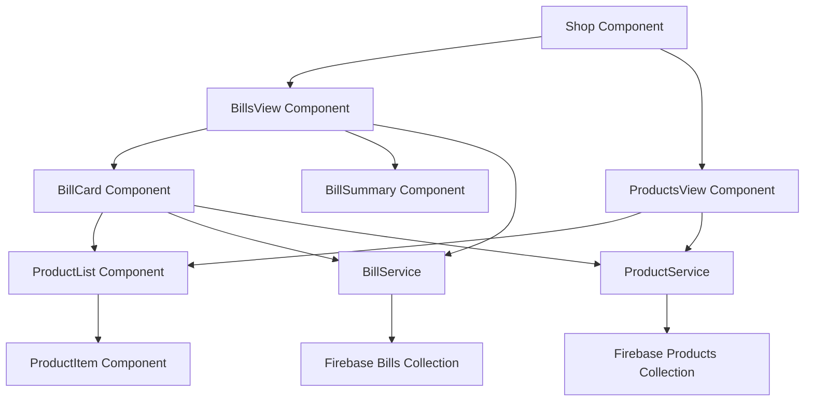

# Design Document

## Overview

The bill-wise product separation feature will transform the current flat product structure into a hierarchical bill-product relationship. This design introduces a new `Bill` entity that groups products together, while maintaining backward compatibility with existing product data. The system will support both bill-centric and product-centric views, allowing users to manage inventory at both levels.

## Architecture

### Data Model Changes

The system will introduce a new data structure while preserving existing product functionality:

```
Bills Collection (New)
├── billId (auto-generated)
├── billNumber (user-friendly identifier)
├── date
├── vendor
├── totalAmount (calculated)
├── totalQuantity (calculated)
├── totalProfit (calculated)
├── createdAt
└── updatedAt

Products Collection (Modified)
├── productId (existing)
├── billId (new foreign key reference)
├── billNumber (existing, now redundant but kept for migration)
├── productName
├── category
├── mrp
├── totalQuantity
├── totalAmount
├── pricePerPiece
├── profitPerPiece
└── ... (other existing fields)
```

### Component Architecture



## Components and Interfaces

### 1. BillService (New Firebase Service)

```javascript
// Core bill operations
export const addBill = async (billData) => { ... }
export const getBills = async () => { ... }
export const updateBill = async (billId, updateData) => { ... }
export const deleteBill = async (billId) => { ... }
export const subscribeToBills = (callback) => { ... }

// Bill-product relationship operations
export const getBillWithProducts = async (billId) => { ... }
export const addProductToBill = async (billId, productData) => { ... }
export const removeProductFromBill = async (billId, productId) => { ... }

// Bill analytics
export const getBillAnalytics = async () => { ... }
export const getBillsByVendor = async (vendor) => { ... }
export const getBillsByDateRange = async (startDate, endDate) => { ... }
```

### 2. Enhanced ProductService

```javascript
// Modified to work with bills
export const addShopProduct = async (productData, billId) => { ... }
export const getProductsByBill = async (billId) => { ... }
export const moveProductToBill = async (productId, newBillId) => { ... }

// Migration utilities
export const migrateProductsToBills = async () => { ... }
export const groupProductsByBillNumber = async () => { ... }
```

### 3. BillsView Component

Primary interface for bill management:

```javascript
const BillsView = () => {
  // State management for bills, filters, sorting
  // Bill CRUD operations
  // Bill-level analytics
  // Search and filter functionality
  // Export capabilities
}
```

### 4. BillCard Component

Individual bill display and management:

```javascript
const BillCard = ({ bill, onEdit, onDelete, onDuplicate }) => {
  // Bill summary information
  // Quick actions (edit, delete, duplicate)
  // Expandable product list
  // Bill-level statistics
}
```

### 5. Enhanced Shop Component

Modified to support both views:

```javascript
const Shop = () => {
  const [viewMode, setViewMode] = useState('bills'); // 'bills' or 'products'
  
  // Toggle between bill-centric and product-centric views
  // Shared search and filter state
  // Analytics that work for both views
}
```

## Data Models

### Bill Model

```javascript
const BillSchema = {
  id: String, // Firestore document ID
  billNumber: String, // User-friendly identifier (B001, B002, etc.)
  date: Date,
  vendor: String,
  totalAmount: Number, // Calculated from products
  totalQuantity: Number, // Calculated from products
  totalProfit: Number, // Calculated from products
  productCount: Number, // Number of products in bill
  createdAt: Timestamp,
  updatedAt: Timestamp,
  
  // Optional metadata
  notes: String,
  status: String, // 'active', 'archived', 'returned'
}
```

### Enhanced Product Model

```javascript
const ProductSchema = {
  // Existing fields
  id: String,
  productName: String,
  category: String,
  vendor: String,
  mrp: Number,
  totalQuantity: Number,
  totalAmount: Number,
  pricePerPiece: Number,
  profitPerPiece: Number,
  date: Date,
  
  // New fields
  billId: String, // Reference to Bill document
  billNumber: String, // Kept for backward compatibility
  
  // Calculated fields
  totalProfit: Number, // profitPerPiece * totalQuantity
  
  // Existing timestamps
  createdAt: Timestamp,
  updatedAt: Timestamp
}
```

## Error Handling

### Data Integrity

1. **Orphaned Products**: Products without valid billId will be handled gracefully
2. **Bill Consistency**: Bill totals will be recalculated when products are modified
3. **Concurrent Updates**: Use Firestore transactions for bill-product operations
4. **Migration Safety**: Backup existing data before migration

### User Experience

1. **Loading States**: Show appropriate loading indicators during bill operations
2. **Error Messages**: Clear, actionable error messages for failed operations
3. **Optimistic Updates**: Update UI immediately, rollback on failure
4. **Validation**: Client-side validation before Firebase operations

## Testing Strategy

### Unit Tests

1. **BillService Functions**: Test all CRUD operations and calculations
2. **ProductService Enhancements**: Test bill-product relationship operations
3. **Data Validation**: Test input validation and error handling
4. **Calculation Logic**: Test bill total calculations and aggregations

### Integration Tests

1. **Bill-Product Relationships**: Test adding/removing products from bills
2. **Migration Process**: Test data migration with various scenarios
3. **Real-time Updates**: Test Firebase subscription updates
4. **Search and Filtering**: Test complex query operations

### Component Tests

1. **BillsView Component**: Test bill display, filtering, and operations
2. **BillCard Component**: Test bill summary and product list expansion
3. **Enhanced Shop Component**: Test view mode switching and shared state
4. **Form Components**: Test bill creation and editing forms

### End-to-End Tests

1. **Complete Bill Workflow**: Create bill, add products, edit, delete
2. **Migration Workflow**: Test complete data migration process
3. **Analytics Updates**: Test that analytics reflect bill changes
4. **Export Functionality**: Test CSV export for bills and products

## Performance Considerations

### Database Optimization

1. **Composite Indexes**: Create indexes for bill-product queries
2. **Pagination**: Implement pagination for large bill lists
3. **Caching**: Cache frequently accessed bill summaries
4. **Batch Operations**: Use batch writes for multi-product operations

### UI Performance

1. **Virtual Scrolling**: For large bill/product lists
2. **Lazy Loading**: Load product details on demand
3. **Memoization**: Prevent unnecessary re-renders
4. **Debounced Search**: Optimize search input handling

## Migration Strategy

### Phase 1: Data Structure Setup

1. Create Bills collection in Firebase
2. Add billId field to existing products
3. Deploy new Firebase service functions

### Phase 2: Data Migration

1. Group existing products by billNumber
2. Create Bill documents for each group
3. Update products with billId references
4. Validate data integrity

### Phase 3: UI Implementation

1. Implement BillsView component
2. Add view mode toggle to Shop component
3. Update analytics to support bills
4. Add bill-level operations

### Phase 4: Testing and Rollout

1. Comprehensive testing with migrated data
2. User acceptance testing
3. Performance monitoring
4. Gradual feature rollout

## Security Considerations

### Firebase Rules

```javascript
// Bills collection rules
rules_version = '2';
service cloud.firestore {
  match /databases/{database}/documents {
    match /bills/{billId} {
      allow read, write: if request.auth != null;
    }
    
    match /shopProducts/{productId} {
      allow read, write: if request.auth != null;
      // Ensure billId references valid bill
      allow update: if resource.data.billId == request.resource.data.billId 
                   || exists(/databases/$(database)/documents/bills/$(request.resource.data.billId));
    }
  }
}
```

### Data Validation

1. **Bill Number Uniqueness**: Ensure bill numbers are unique
2. **Product-Bill Consistency**: Validate billId references exist
3. **Calculation Accuracy**: Server-side validation of calculated fields
4. **Input Sanitization**: Sanitize all user inputs

This design provides a robust foundation for implementing bill-wise product separation while maintaining system performance and data integrity.